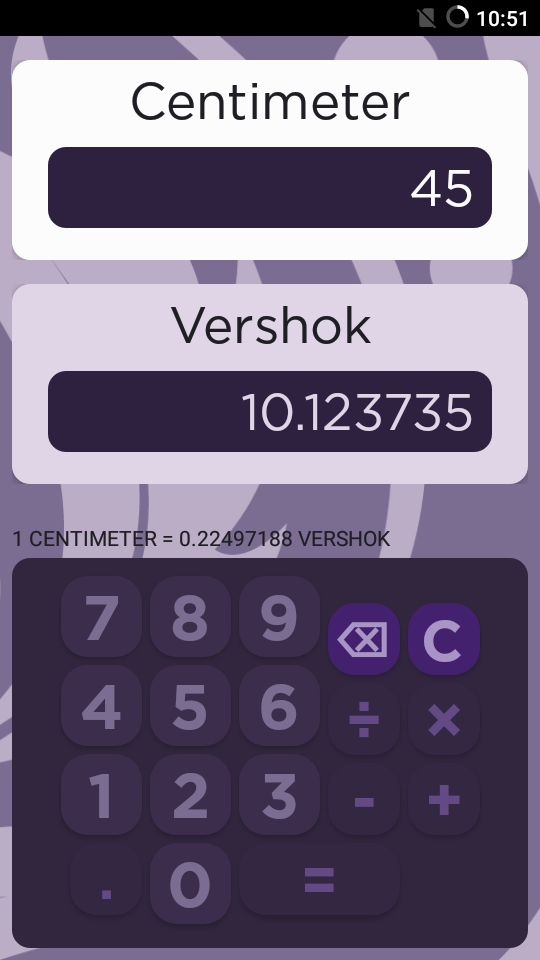
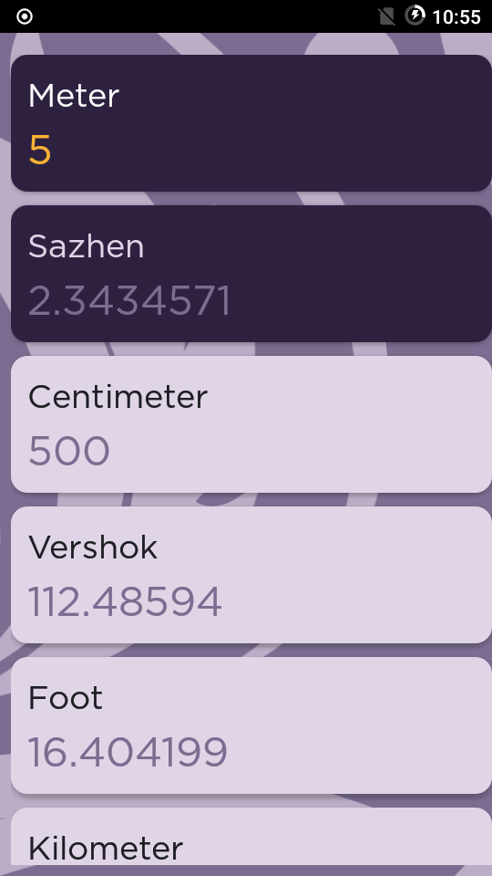
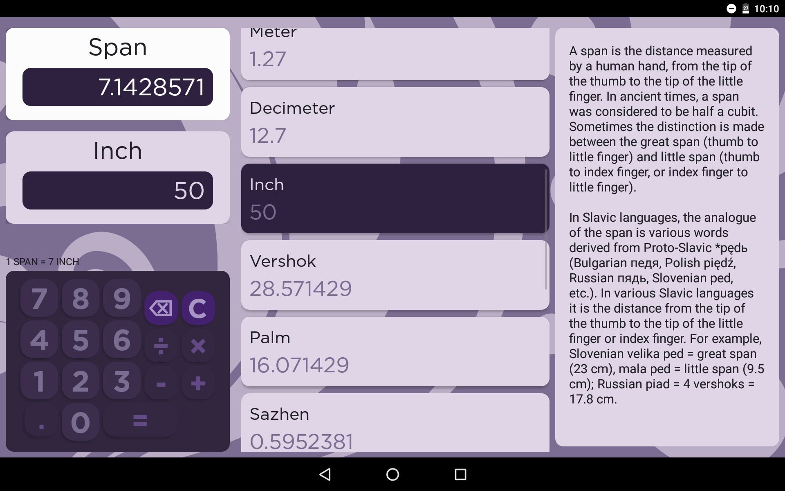

# Imperial Russia


[](https://codebeat.co/projects/github-com-mikolasan-imperialrussia-master)
[](https://www.codacy.com/manual/SaturdaysCode/ImperialRussia?utm_source=github.com&amp;utm_medium=referral&amp;utm_content=mikolasan/ImperialRussia&amp;utm_campaign=Badge_Grade)
[](https://codeclimate.com/github/mikolasan/ImperialRussia/maintainability)


**Imerial Russia** is a historic unit converter app for Android

It also includes simple arithmetic calculator.

Written in Kotlin. Minimum supported Android version is 4.4.


## Roadmap

- Another unit types: volume, weight
- Slavic calendar
- ...


## Download

<a href="https://play.google.com/store/apps/details?id=xyz.neupokoev.forgottenstandards&amp;pcampaignid=pcampaignidMKT-Other-global-all-co-prtnr-py-PartBadge-Mar2515-1">

</a>


## About

If you are reading a literary book about 18th century, or studying history, or you feel limited with the standard units of measurements, or by any other means find yourself curious about historic units used one or two centuries ago, like when it was time of Russian Empire, then this app might take you interest.

Jump into the new world measured by arshin, versta, sazhen. Measure like Russian.


## Privacy policy

See [this privacy policy](https://neupokoev.xyz/projects/imperial-russia/privacy-policy) for details.


## Screenshots

|Main screen|Unit list|Landscape mode|
|---|---|---|
||


## For developers


### Architecture

- [Kotlin](https://kotlinlang.org/)
- [KotlinPoet](https://square.github.io/kotlinpoet/) for genereting complete graph of conversions
- ViewPager
- RecyclerView
- Simple [recursive descent parser](https://en.wikipedia.org/wiki/Recursive_descent_parser) in the calculator
- SharedPreferences for persistancy
- [Markwon](https://noties.io/Markwon/) Markdown library without WebView requirement
- [Observer pattern](https://en.wikipedia.org/wiki/Observer_pattern) used in the Main Activity. Child fragments call method in the activity and depending on the layout if other fragments exist, then the message will be delivered to them.
- Different layouts: landscape (no main panels), tablet landscape (additional info panel), portrait, spacious portrait (additional info panel). Smart watch and auto layouts are in the roadmap.


### How to use Ratio Generator

To generate just for one unit type:

```
set unit=Angle
gradle -PimperialUnits=%unit%Units.kt ratiogenerator:runRatioGenerator --args="--className io.github.mikolasan.ratiogenerator.Min%unit%Units --objectName %unit%Units"
```

Generate for all units:

```shell
generate_units.bat
```


## License

MIT
